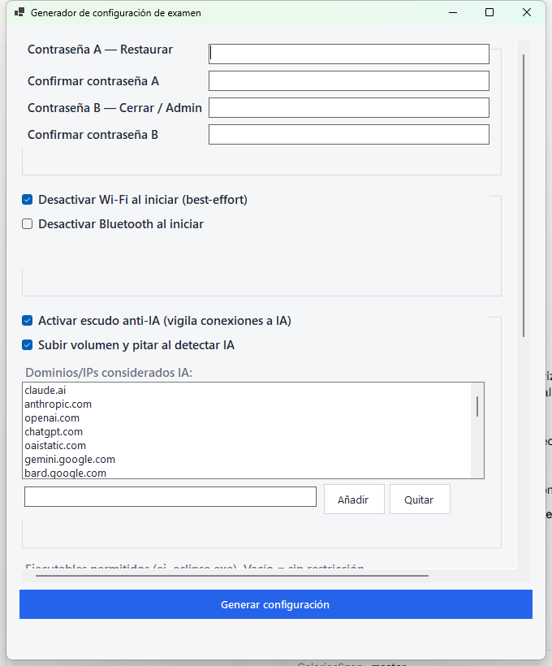
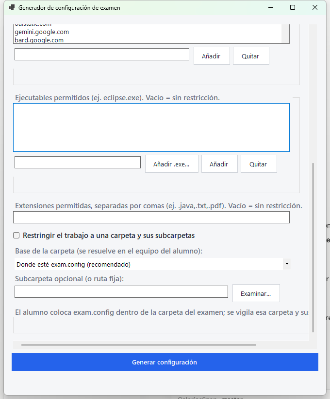
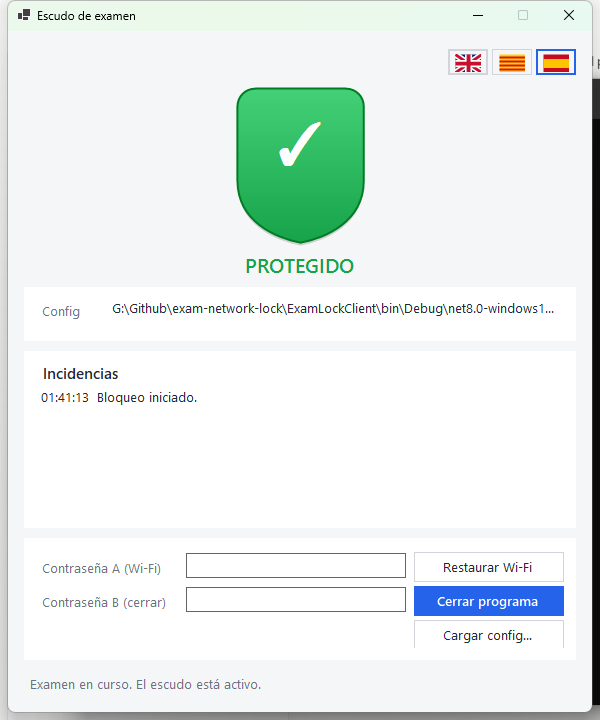
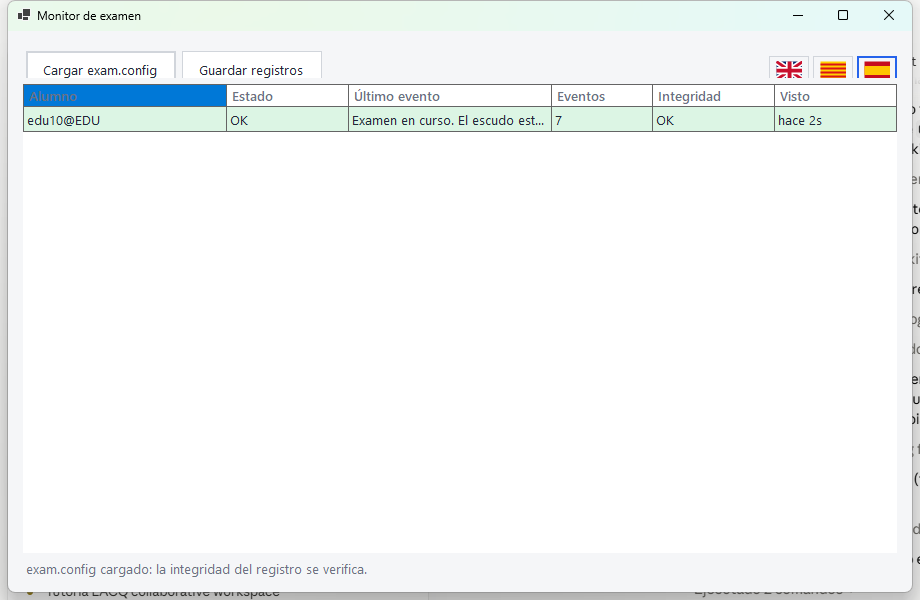

# Exam Network Locking

**Languages / Idiomes / Idiomas:** [English](#english) · [Català](#català) · [Castellano](#castellano)

Classroom exam-locking system. Two desktop apps (WinForms, .NET 8) plus a log verifier.
Sistema de bloqueig per a exàmens. Dues aplicacions d'escriptori més un verificador de registres.
Sistema de bloqueo para exámenes. Dos aplicaciones de escritorio más un verificador de registros.

---

## English

Classroom exam-locking system. It is made of two desktop applications (WinForms, .NET 8) and a
log verifier:

- **ExamConfigGenerator** — the **teacher** app: generates a signed `exam.config`.
- **ExamLockClient** — the **student** app: enforces the lockdown and shows the shield.
- **ExamMonitor** — the **teacher** dashboard: a live grid of students over the LAN.
- **ExamShared** — shared library (models, cryptography, hash-chained log).
- **ExamLogVerifier** — console tool that validates the log afterwards.
- **ExamLogVerifierUI** — desktop app to verify **many** logs at once: drag in the exam folders,
  load the `exam.config`, and each log turns green (intact), amber (warnings) or red (tampered or
  AI/forbidden-file incidents). Selecting a log shows its events on the right, Finder-style.

It is a **deterrent system with evidence**: it leaves a tamper-evident log (`examlog.jsonl`).
A student can force-close it from Task Manager, but it will be recorded as an unclean exit and
the teacher will see it.

Both apps have a **language switcher** (flag buttons, top-right: 🇬🇧 English · Catalan ·
🇪🇸 Spanish). The choice is detected from the system on first run and remembered.

### How it works

1. The teacher generates `exam.config` (passwords, what is allowed, AI shield…).
2. They copy that file to the student machine.
3. The student opens `ExamLockClient`: the lockdown applies and the shield appears.
4. When finished, the teacher enters their password to restore the network and/or close.
5. Afterwards, `ExamLogVerifier` checks that the log has not been altered.

### Teacher app — ExamConfigGenerator

Generates the `exam.config`, signed with HMAC (it cannot be tampered with without the client
noticing).



- **Passwords** (must be different):
  - **A — Restore Wi-Fi**: re-enables the radios. Does not close the app.
  - **B — Close / Admin**: silences the shield, re-enables the radios and **closes** the app.
    It also resolves a red AI alarm.
- **Radios**: disable Wi-Fi and/or Bluetooth on start (best-effort).
- **AI shield**: monitors connections to AI against an **editable list** of domains (ships with
  the usual ones: claude.ai, openai/chatgpt, gemini, copilot, perplexity…). It can raise the
  volume and beep on detection.



- **Allowed programs**: list of executables (e.g. `eclipse.exe`). Empty = no restriction. Only
  the `.exe` **name** is stored, so it works even if the install path differs between machines.
- **Allowed file types**: e.g. `.java,.txt,.pdf`. Empty = no restriction.
- **Blocked file types**: e.g. `.exe,.zip`. Empty = nothing blocked. Disabled when allowed file
  types are set, because an allow-list is already stricter (it permits only the listed types).
- **Work folder (portable)**: restrict work to a folder and its subfolders. The base is
  resolved **on the student machine**, so the same config works on every laptop even with
  different usernames:
  - *Where exam.config is* (recommended): the folder the student extracts the exam into.
  - *Student Desktop* / *Documents*: resolved per user (e.g.
    `C:\Users\<student>\Desktop\<subfolder>`).
  - *Fixed path*: an absolute path identical on every machine.

### Student app — ExamLockClient



- **Colored shield**, large and readable from afar, and **minimizable** (keeps running):
  - 🟢 **PROTEGIDO** (protected) — all good.
  - 🟡 **ATENCIÓN** (attention) — unknown program or file type.
  - 🔴 **PELIGRO** (danger) — AI connection, forbidden file, or work outside the folder.
- **Config / Incidents**: shows the loaded file and an event history.
- **Restore Wi-Fi password**: restores the network without closing.
- **Close program password**: the only way to close the app. A force-close from Task Manager is
  recorded as an unclean session in the log.

On a red AI detection the app **beeps and raises the volume**, and the alarm persists until the
teacher enters the **close program password** (the "teacher walks over and silences it" flow).

#### AI detection is a safety net

The shield monitors real TCP connections, so it **fires even if disabling Wi-Fi failed** on a
particular laptop — the "double check" that simply turning off the driver cannot guarantee. It
also reads the **DNS resolver cache**, so it catches CLI/IDE agents (Codex, Claude Code,
Copilot…) that talk to `api.*` endpoints, even after the connection closes. **AI desktop tools**
(Cursor, Windsurf, the ChatGPT/Claude desktop apps, local LLMs) and running **virtual machines**
(VirtualBox, VMware, Hyper-V, QEMU) are flagged by process name.

TCP detections are attributed to the owning process when Windows exposes its PID. A browser, IDE,
editor, developer runtime, or AI tool talking to an AI endpoint raises a red alarm. DNS-only or
unattributed matches are logged as amber warnings so the teacher can distinguish background system
traffic from stronger student-app evidence.

Limits: traffic generated *inside* a bridged VM, or on a second device such as a phone, is not
visible to the host — that is what proctoring and the log are for. A running VM is still flagged.

#### File monitoring is a deterrent

It is heuristic: a `FileSystemWatcher` over the work folder plus command-line inspection of
document-opener apps (and any the teacher allows). It leaves evidence in the log; it is not an
exhaustive hook on every file open. Tune the allowed extensions/folder to reduce false
positives.

### Teacher monitor — ExamMonitor



A live dashboard on the teacher's PC. Each client **broadcasts** its shield state and
tamper-evident log over the LAN (UDP, send-only); the monitor listens and shows one row per
student, identified by **user@machine**: state (green/amber/red), last event, number of log
entries and **integrity** (verified with the `LogSecret` from `exam.config`, so tampering shows
here too). No IP setup — students are discovered automatically.

In lockdown mode (Wi-Fi disabled) the data arrives **when the student restores the connection**
(password A) to upload the exam; in monitored mode it streams live. The monitor needs inbound
UDP allowed (Windows Firewall) and works on a single LAN/subnet — networks with client
isolation may block it. If broadcast discovery is unreliable, enter the teacher PC's monitor IP
in the config generator (for example `192.168.1.70`); the client will send direct UDP status
packets to that address in addition to LAN broadcasts.

### Build

Requirement: .NET 8 SDK for Windows. The client targets `net8.0-windows10.0.19041.0` to use the
WinRT Radios API (Bluetooth).

```powershell
dotnet build .\ExamLocking.sln
```

### Run

1. Open `ExamConfigGenerator`, fill in the options and generate `exam.config`.
2. Copy `exam.config` to the student machine.
3. Open `ExamLockClient` (it auto-loads `exam.config` from its folder, or pick it).

### Verify a log

Single log, from the console:

```powershell
dotnet run --project .\ExamLogVerifier -- .\exam.config .\examlog.jsonl
```

Many logs, with a UI: open `ExamLogVerifierUI`, drag in the student exam folders (it finds every
`examlog.jsonl` recursively), load the `exam.config`, and press **Verify**. Each log shows green /
amber / red; click one to inspect its events on the right, filter the list by event type, and
optionally export a CSV summary.

### Runtime files

Stored next to the selected `exam.config`: `exam.config`, `examlog.jsonl` (tamper-evident,
hash-chained log) and `session.lock` (unclean-shutdown marker).

### Wi-Fi adapter name

The client uses `netsh` with the adapter `Wi-Fi` by default. If yours is named differently
(e.g. `Wi-Fi 2`), change `AdapterName` in `ExamLockClient\NetworkAdapterService.cs`.

### Permissions

The client requires administrator rights (manifest `requireAdministrator`) to disable the
network adapter and the Bluetooth radio.

### Notes

A practical deterrent system with tamper evidence, not a fully secure lock against an
administrator user.

---

## Català

Sistema de bloqueig per a exàmens a l'aula. El formen dues aplicacions d'escriptori (WinForms,
.NET 8) i un verificador de registres:

- **ExamConfigGenerator** — app del **professor**: genera un `exam.config` signat.
- **ExamLockClient** — app de l'**alumne**: aplica el bloqueig i mostra l'escut.
- **ExamMonitor** — el **panell** del professor: graella d'alumnes en viu per la LAN.
- **ExamShared** — biblioteca comuna (models, criptografia, registre encadenat).
- **ExamLogVerifier** — consola que valida el registre a posteriori.
- **ExamLogVerifierUI** — app d'escriptori per verificar **molts** registres alhora: arrossega-hi
  les carpetes d'examen, carrega l'`exam.config` i cada registre es posa verd (íntegre), groc
  (avisos) o vermell (manipulat o incidències d'IA/fitxer prohibit). En seleccionar-ne un, veus
  els seus esdeveniments a la dreta, a l'estil Finder.

És un sistema de **dissuasió amb evidència**: deixa un registre a prova de manipulació
(`examlog.jsonl`). L'alumne pot forçar el tancament des de l'Administrador de tasques, però
quedarà marcat com a tancament brut i el professor ho veurà.

Les dues apps tenen un **selector d'idioma** (botons de bandera, a dalt a la dreta: anglès ·
català · castellà). Es detecta del sistema en el primer arrencada i es recorda.

### Com funciona

1. El professor genera `exam.config` (contrasenyes, què es permet, escut anti-IA…).
2. Copia aquest fitxer a l'equip de l'alumne.
3. L'alumne obre `ExamLockClient`: s'aplica el bloqueig i apareix l'escut.
4. En acabar, el professor introdueix la seva contrasenya per restaurar la xarxa i/o tancar.
5. Després, `ExamLogVerifier` comprova que el registre no s'ha alterat.

### App del professor — ExamConfigGenerator

Genera el `exam.config`, signat amb HMAC (no es pot manipular sense que el client ho detecti).


- **Contrasenyes** (han de ser diferents):
  - **A — Restaurar Wi-Fi**: reactiva les ràdios. No tanca l'app.
  - **B — Tancar / Admin**: silencia l'escut, reactiva les ràdios i **tanca** l'app. També
    resol una alarma vermella d'IA.
- **Ràdios**: desactivar Wi-Fi i/o Bluetooth en iniciar (*best-effort*).
- **Escut anti-IA**: vigila les connexions a IA contra una **llista editable** de dominis (ja
  porta els habituals: claude.ai, openai/chatgpt, gemini, copilot, perplexity…). Pot apujar el
  volum i xiular en detectar-ho.


- **Programes permesos**: llista d'executables (p. ex. `eclipse.exe`). Buit = sense restricció.
  Només es desa el **nom** de l'`.exe`, així funciona encara que la ruta d'instal·lació canviï
  entre equips.
- **Extensions permeses**: p. ex. `.java,.txt,.pdf`. Buit = sense restricció.
- **Extensions bloquejades**: p. ex. `.exe,.zip`. Buit = res bloquejat. Es desactiva si hi ha
  extensions permeses, perquè la llista de permeses ja és més estricta (només permet les indicades).
- **Carpeta de treball (portable)**: restringeix el treball a una carpeta i les seves
  subcarpetes. La base es resol **a l'equip de l'alumne**, de manera que la mateixa configuració
  serveix per a tots els portàtils encara que el nom d'usuari sigui diferent:
  - *On sigui exam.config* (recomanat): la carpeta on l'alumne descomprimeix l'examen.
  - *Escriptori* / *Documents de l'alumne*: es resol per usuari (p. ex.
    `C:\Users\<alumne>\Desktop\<subcarpeta>`).
  - *Ruta fixa*: una ruta absoluta idèntica a tots els equips.

### App de l'alumne — ExamLockClient


- **Escut de color**, gran i llegible de lluny, i **minimitzable** (segueix funcionant):
  - 🟢 **PROTEGIDO** (protegit) — tot correcte.
  - 🟡 **ATENCIÓN** (atenció) — programa o tipus de fitxer desconegut.
  - 🔴 **PELIGRO** (perill) — connexió a IA, fitxer no permès o treball fora de la carpeta.
- **Config / Incidències**: mostra el fitxer carregat i un historial d'esdeveniments.
- **Contrasenya per restaurar Wi-Fi**: restaura la xarxa sense tancar.
- **Contrasenya per tancar el programa**: única manera de tancar l'app. Un tancament forçat des de
  l'Administrador de tasques queda com a sessió bruta al registre.

En detectar una IA en vermell, l'app **xiula i apuja el volum**, i l'alarma persisteix fins que
el professor introdueix la **contrasenya per tancar el programa** (el flux "el profe s'acosta i la silencia").

#### La detecció d'IA és una xarxa de seguretat

L'escut vigila connexions TCP reals, així que **salta encara que la desactivació del Wi-Fi
falli** en algun portàtil concret — la "doble comprovació" que el simple apagat del driver no
pot garantir. També llegeix la **caché DNS**, de manera que detecta agents de CLI/IDE (Codex,
Claude Code, Copilot…) que parlen amb endpoints `api.*`, fins i tot després de tancar-se la
connexió. Les **eines d'IA d'escriptori** (Cursor, Windsurf, les apps d'escriptori de
ChatGPT/Claude, LLM locals) i les **màquines virtuals** en execució (VirtualBox, VMware,
Hyper-V, QEMU) es detecten pel nom del procés.

Les deteccions TCP s'atribueixen al procés propietari quan Windows n'exposa el PID. Un navegador,
IDE, editor, runtime de desenvolupament o eina d'IA que parli amb un endpoint d'IA genera una alarma
vermella. Les coincidències només per DNS o sense atribució queden com a avisos ambre perquè el
professor pugui distingir trànsit de sistema de proves més fortes d'una app de l'alumne.

Límits: el trànsit generat *dins* d'una VM en mode bridged, o en un segon dispositiu com un
mòbil, no és visible per al host — per a això hi ha la vigilància presencial i el registre. Una
VM en execució, tot i així, queda marcada.

#### La vigilància de fitxers és dissuasiva

És heurística: un `FileSystemWatcher` sobre la carpeta de treball més la inspecció de la línia
d'ordres de les apps que obren documents (i de les que el profe permeti). Deixa evidència al
registre; no és un ganxo exhaustiu de cada obertura. Ajusta extensions/carpeta per reduir
falsos positius.

### Panell del professor — ExamMonitor


Un panell en viu a l'ordinador del professor. Cada client **difon** el seu estat d'escut i el
registre (a prova de manipulació) per la LAN (UDP, només enviament); el monitor escolta i mostra
una fila per alumne, identificat amb **usuari@equip**: estat (verd/ambre/vermell), últim
esdeveniment, nombre d'entrades del registre i **integritat** (verificada amb el `LogSecret` de
l'`exam.config`, així que la manipulació també es veu aquí). Sense configurar IPs: els alumnes
es detecten automàticament.

En mode bloqueig (Wi-Fi desactivat) les dades arriben **quan l'alumne restaura la connexió**
(contrasenya A) per pujar l'examen; en mode vigilància arriben en viu. El monitor necessita
permís d'entrada UDP (tallafocs de Windows) i funciona en una sola LAN/subxarxa — les xarxes amb
aïllament de clients el poden bloquejar. Si el descobriment per broadcast no és fiable, introdueix
la IP del monitor del professor al generador de configuració (per exemple `192.168.1.70`); el
client enviarà paquets UDP directes a aquesta adreça, a més dels broadcasts de la LAN.

### Compilació

Requisit: .NET 8 SDK per a Windows. El client apunta a `net8.0-windows10.0.19041.0` per usar
l'API WinRT de Ràdios (Bluetooth).

```powershell
dotnet build .\ExamLocking.sln
```

### Executar

1. Obre `ExamConfigGenerator`, omple les opcions i genera `exam.config`.
2. Copia `exam.config` a l'equip de l'alumne.
3. Obre `ExamLockClient` (carrega `exam.config` de la seva carpeta automàticament, o el tries).

### Verificar un registre

Un sol registre, des de la consola:

```powershell
dotnet run --project .\ExamLogVerifier -- .\exam.config .\examlog.jsonl
```

Molts registres, amb interfície: obre `ExamLogVerifierUI`, arrossega-hi les carpetes d'examen
dels alumnes (troba cada `examlog.jsonl` de forma recursiva), carrega l'`exam.config` i prem
**Comprova**. Cada registre es posa verd / groc / vermell; fes clic per inspeccionar-ne els
esdeveniments a la dreta, filtra la llista per tipus d'esdeveniment i, si vols, exporta un resum CSV.

### Fitxers en temps d'execució

Es desen al costat del `exam.config` seleccionat: `exam.config`, `examlog.jsonl` (registre
encadenat a prova de manipulació) i `session.lock` (marca de tancament brut).

### Nom de l'adaptador Wi-Fi

El client usa `netsh` amb l'adaptador `Wi-Fi` per defecte. Si el teu es diu diferent (p. ex.
`Wi-Fi 2`), canvia `AdapterName` a `ExamLockClient\NetworkAdapterService.cs`.

### Permisos

El client requereix permisos d'administrador (manifest `requireAdministrator`) per desactivar
l'adaptador de xarxa i la ràdio Bluetooth.

### Notes

És un sistema pràctic de dissuasió amb evidència, no un bloqueig infranquejable davant d'un
usuari administrador.

---

## Castellano

Sistema de bloqueo para exámenes en el aula. Lo forman dos aplicaciones de escritorio
(WinForms, .NET 8) y un verificador de registros:

- **ExamConfigGenerator** — app del **profesor**: genera un `exam.config` firmado.
- **ExamLockClient** — app del **alumno**: aplica el bloqueo y muestra el escudo.
- **ExamMonitor** — el **panel** del profesor: rejilla de alumnos en vivo por la LAN.
- **ExamShared** — biblioteca común (modelos, criptografía, log encadenado).
- **ExamLogVerifier** — consola que valida el registro a posteriori.
- **ExamLogVerifierUI** — app de escritorio para verificar **muchos** logs a la vez: arrastra las
  carpetas de examen, carga el `exam.config` y cada log se pone verde (íntegro), ámbar (avisos) o
  rojo (manipulado o incidencias de IA/archivo prohibido). Al seleccionar uno, ves sus eventos a la
  derecha, estilo Finder.

Es un sistema de **disuasión con evidencia**: deja un registro a prueba de manipulación
(`examlog.jsonl`). El alumno puede forzar el cierre desde el Administrador de tareas, pero
quedará marcado como cierre sucio en el log, y el profesor lo verá.

Las dos apps tienen un **selector de idioma** (botones de bandera, arriba a la derecha: inglés ·
catalán · español). Se detecta del sistema en el primer arranque y se recuerda.

### Cómo funciona

1. El profesor genera `exam.config` (contraseñas, qué se permite, escudo anti-IA…).
2. Copia ese archivo al equipo del alumno.
3. El alumno abre `ExamLockClient`: se aplica el bloqueo y aparece el escudo.
4. Al terminar, el profesor introduce su contraseña para restaurar la red y/o cerrar.
5. Después, `ExamLogVerifier` comprueba que el registro no se ha alterado.

### App del profesor — ExamConfigGenerator

Genera el `exam.config` firmado con HMAC (no se puede manipular sin que el cliente lo detecte).


- **Contraseñas** (deben ser distintas):
  - **A — Restaurar Wi-Fi**: reactiva las radios. No cierra la app.
  - **B — Cerrar / Admin**: silencia el escudo, reactiva las radios y **cierra** la app. Es
    también la que resuelve una alarma roja de IA.
- **Radios**: desactivar Wi-Fi y/o Bluetooth al iniciar (*best-effort*).
- **Escudo anti-IA**: vigila las conexiones a IA contra una **lista editable** de dominios (ya
  trae los habituales: claude.ai, openai/chatgpt, gemini, copilot, perplexity…). Puede subir el
  volumen y pitar al detectar una conexión.


- **Programas permitidos**: lista de ejecutables (ej. `eclipse.exe`). Vacío = sin restricción.
  Se guarda solo el **nombre** del `.exe`, así funciona aunque la ruta de instalación cambie
  entre equipos.
- **Extensiones permitidas**: ej. `.java,.txt,.pdf`. Vacío = sin restricción.
- **Extensiones no permitidas**: ej. `.exe,.zip`. Vacío = no bloquea nada. Se desactiva si hay
  extensiones permitidas, porque la lista de permitidas ya es más estricta (solo permite las indicadas).
- **Carpeta de trabajo (portable)**: restringe el trabajo a una carpeta y sus subcarpetas. La
  base se resuelve **en el equipo del alumno**, así que el mismo config vale para todos los
  portátiles aunque el nombre de usuario sea distinto:
  - *Donde esté exam.config* (recomendado): la carpeta donde el alumno descomprime el examen.
  - *Escritorio* / *Documentos del alumno*: se resuelve por usuario (p. ej.
    `C:\Users\<alumno>\Desktop\<subcarpeta>`).
  - *Ruta fija*: una ruta absoluta idéntica en todos los equipos.

### App del alumno — ExamLockClient


- **Escudo de color**, grande y legible desde lejos, y **minimizable** (sigue funcionando):
  - 🟢 **PROTEGIDO** — todo correcto.
  - 🟡 **ATENCIÓN** — programa o tipo de archivo desconocido.
  - 🔴 **PELIGRO** — conexión a IA, archivo no permitido o trabajo fuera de la carpeta.
- **Config / Incidencias**: muestra el archivo cargado y un historial de eventos.
- **Contraseña para restaurar Wi-Fi**: restaura la red sin cerrar.
- **Contraseña para cerrar el programa**: única forma de cerrar la app. Un cierre forzado por el
  Administrador de tareas queda como sesión sucia en el log.

Al detectar una IA en rojo, la app **pita y sube el volumen**, y la alarma persiste hasta que el
profesor introduce la **contraseña para cerrar el programa** (el flujo "el profe se acerca y la silencia").

#### La detección de IA es una red de seguridad

El escudo vigila conexiones TCP reales, así que **salta aunque el desactivado del Wi-Fi falle**
en algún portátil concreto — el "doble check" que el simple apagado del driver no garantiza.
También lee la **caché DNS**, así que detecta agentes de CLI/IDE (Codex, Claude Code,
Copilot…) que hablan con endpoints `api.*`, incluso después de cerrarse la conexión. Las
**herramientas de IA de escritorio** (Cursor, Windsurf, las apps de escritorio de
ChatGPT/Claude, LLM locales) y las **máquinas virtuales** en ejecución (VirtualBox, VMware,
Hyper-V, QEMU) se detectan por el nombre del proceso.

Las detecciones TCP se atribuyen al proceso propietario cuando Windows expone su PID. Un navegador,
IDE, editor, runtime de desarrollo o herramienta de IA hablando con un endpoint de IA genera alarma
roja. Las coincidencias solo por DNS o sin atribución quedan como avisos ámbar para que el profesor
distinga tráfico de sistema de evidencia más fuerte de una app del alumno.

Límites: el tráfico generado *dentro* de una VM en modo bridged, o en un segundo dispositivo
como un móvil, no es visible para el host — para eso están la vigilancia presencial y el
registro. Una VM en ejecución, aun así, queda marcada.

#### La vigilancia de archivos es disuasoria

Es heurística: un `FileSystemWatcher` sobre la carpeta de trabajo más la inspección de la línea
de comandos de las apps que abren documentos (y de las que el profe permita). Deja evidencia en
el log; no es un gancho exhaustivo de cada apertura. Ajusta extensiones/carpeta para reducir
falsos positivos.

### Panel del profesor — ExamMonitor


Un panel en vivo en el ordenador del profesor. Cada cliente **difunde** su estado de escudo y el
registro (a prueba de manipulación) por la LAN (UDP, solo envío); el monitor escucha y muestra
una fila por alumno, identificado con **usuario@equipo**: estado (verde/ámbar/rojo), último
evento, número de entradas del registro e **integridad** (verificada con el `LogSecret` del
`exam.config`, así que la manipulación también se ve aquí). Sin configurar IPs: los alumnos se
detectan automáticamente.

En modo bloqueo (Wi-Fi desactivado) los datos llegan **cuando el alumno restaura la conexión**
(contraseña A) para subir el examen; en modo vigilancia llegan en vivo. El monitor necesita
permiso de entrada UDP (firewall de Windows) y funciona en una sola LAN/subred — las redes con
aislamiento de clientes pueden bloquearlo. Si el descubrimiento por broadcast no es fiable,
introduce la IP del monitor del profesor en el generador de configuración (por ejemplo
`192.168.1.70`); el cliente enviará paquetes UDP directos a esa dirección además de los broadcasts
de la LAN.

### Build

Requisito: .NET 8 SDK para Windows. El cliente apunta a `net8.0-windows10.0.19041.0` para usar
la API WinRT de Radios (Bluetooth).

```powershell
dotnet build .\ExamLocking.sln
```

### Ejecutar

1. Abre `ExamConfigGenerator`, rellena las opciones y genera `exam.config`.
2. Copia `exam.config` al equipo del alumno.
3. Abre `ExamLockClient` (carga `exam.config` de su carpeta automáticamente, o lo eliges).

### Verificar un registro

Un solo log, desde la consola:

```powershell
dotnet run --project .\ExamLogVerifier -- .\exam.config .\examlog.jsonl
```

Muchos logs, con interfaz: abre `ExamLogVerifierUI`, arrastra las carpetas de examen de los
alumnos (encuentra cada `examlog.jsonl` de forma recursiva), carga el `exam.config` y pulsa
**Comprobar**. Cada log se pone verde / ámbar / rojo; haz clic para inspeccionar sus eventos a la
derecha, filtra la lista por tipo de evento y, si quieres, exporta un resumen CSV.

### Archivos en tiempo de ejecución

Se guardan junto al `exam.config` seleccionado: `exam.config`, `examlog.jsonl` (registro
encadenado a prueba de manipulación) y `session.lock` (marca de cierre sucio).

### Nombre del adaptador Wi-Fi

El cliente usa `netsh` con el adaptador `Wi-Fi` por defecto. Si el tuyo se llama distinto (p. ej.
`Wi-Fi 2`), cambia `AdapterName` en `ExamLockClient\NetworkAdapterService.cs`.

### Permisos

El cliente requiere permisos de administrador (manifiesto `requireAdministrator`) para
desactivar el adaptador de red y la radio Bluetooth.

### Notas

Es un sistema práctico de disuasión con evidencia, no un bloqueo infranqueable frente a un
usuario administrador.
