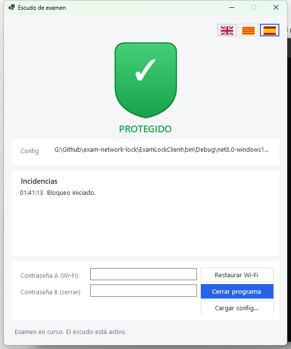
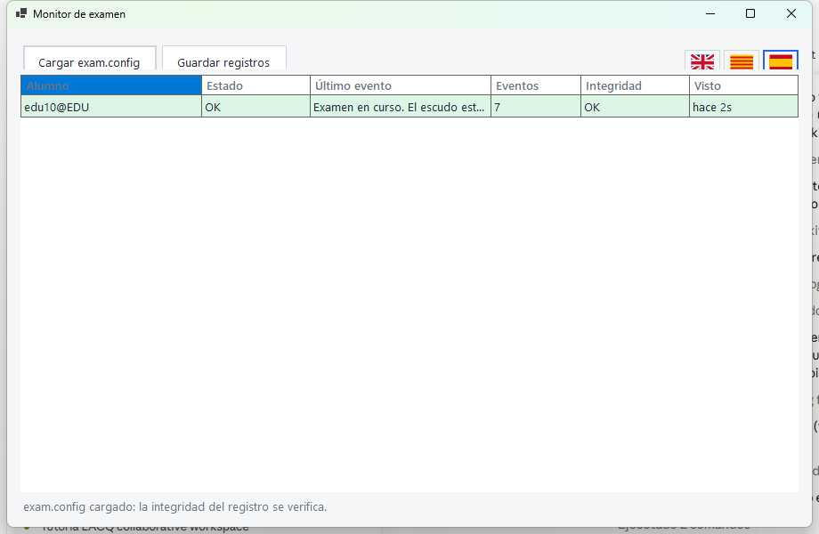

# Exámenes con confianza

## Guía práctica para el profesorado

**Exam Network Locking · Windows · Edición en castellano**

Prepara las reglas, acompaña al alumnado y revisa lo ocurrido con un recorrido claro, desde la configuración hasta la entrega.

> **Tres ideas para empezar.** El generador prepara las reglas. El cliente las aplica y registra indicios. El monitor y el verificador ayudan a supervisar y revisar.

### Qué puedes hacer con estas herramientas

- Intentar desactivar Wi-Fi y Bluetooth al comenzar el examen.
- Detectar indicios de IA, máquinas virtuales, programas prohibidos y actividad de archivos fuera de las reglas.
- Consultar el estado de los equipos cuando exista conexión con el ordenador del profesor.
- Revisar los registros al terminar y comprobar su integridad con la configuración original.

### Qué debes tener presente

El sistema ayuda a supervisar y deja evidencias de lo que detecta. Las listas de programas y las reglas de archivos **generan avisos; no impiden su ejecución o acceso**. La vigilancia de archivos es experimental y no detecta todas las aperturas.

Un aviso necesita contexto. Un resultado verde tampoco garantiza que no haya ocurrido nada fuera del alcance de la herramienta. La supervisión del aula sigue siendo necesaria.

**Cómo usar esta guía:** sigue las páginas 2 a 10 en tu primer examen. Después, consulta las soluciones de la página 11 y conserva a mano la hoja rápida de la página 13.

**Referencia:** funciones revisadas en el código del proyecto, revisión `21c03dc`, 9 de septiembre de 2026. Las capturas existentes son orientativas y pueden mostrar etiquetas o distribuciones anteriores.

<!-- pagebreak -->

# 01 · Elige la herramienta adecuada

Cada aplicación tiene una función distinta. El alumnado solo necesita abrir el cliente.

| Herramienta | Quién la utiliza y para qué |
| --- | --- |
| **ExamConfigGenerator** | Profesorado, antes del examen. Crea `exam.config` con contraseñas y reglas. |
| **ExamLockClient** | Alumnado, en su ordenador. Carga la configuración, muestra el escudo y guarda los eventos. |
| **ExamMonitor** | Profesorado, durante el examen o la entrega. Recibe el estado y los registros por la red local. |
| **ExamLogVerifierUI** | Profesorado, después. Revisa varios registros mediante ventanas, filtros y exportación de un resumen. |
| **ExamLogVerifier** | Herramienta de consola para soporte técnico. Para el uso docente habitual, utiliza ExamLogVerifierUI. |
| **ExamShared** | Componente interno compartido. No es una aplicación que tengas que abrir. |

### El recorrido de un examen

1. **Preparar:** genera una configuración y pruébala con los programas del aula.
2. **Distribuir:** entrega el cliente, los materiales y `exam.config`.
3. **Iniciar:** comprueba que cada alumno ha cargado las reglas y que el escudo está activo.
4. **Supervisar:** observa los escudos y, si hay conexión, el monitor.
5. **Entregar y cerrar:** utiliza A para entregar por Internet y B para finalizar.
6. **Revisar:** reúne los registros definitivos y compruébalos con la configuración original.

### Antes de tu primera sesión

- Pide al responsable técnico las aplicaciones Windows actualizadas y comprueba que también tienes el monitor y el verificador con interfaz.
- Prueba el cliente en un equipo del alumnado con los permisos necesarios para gestionar Wi-Fi y Bluetooth.
- Prepara una carpeta nueva para cada examen y guarda una copia docente del `exam.config` original.
- Usa las banderas para seleccionar castellano, catalán o inglés. Esta guía utiliza los nombres en castellano.

> **Prueba completa:** ensaya abrir materiales, guardar respuestas, restaurar la conexión, cerrar con B y verificar el registro. Así comprobarás todo el recorrido antes de trabajar con el grupo.

<!-- pagebreak -->

# 02 · Configura contraseñas y conexión

Abre **ExamConfigGenerator**. Sus opciones se guardan al pulsar **Generar configuración**; no cambian automáticamente los equipos del alumnado.

### Dos contraseñas, dos momentos

| Campo | Para qué sirve | Cuándo usarlo |
| --- | --- | --- |
| **Contraseña para rehabilitar Wi-Fi (A)** | Intenta recuperar las radios configuradas y activa el modo de entrega. El cliente sigue abierto; la vigilancia de archivos se pausa. | Al autorizar la entrega por Internet. |
| **Contraseña para cerrar el programa (B)** | Silencia las alarmas, detiene la vigilancia, intenta recuperar las radios y cierra la aplicación. | Para finalizar la sesión o intervenir cerrándola. |

1. Escribe A y repítela en su confirmación.
2. Escribe B y repítela en su confirmación.
3. Comprueba que **ambas están rellenadas y son distintas**. Consérvalas bajo control docente.

### Elige cómo trabajarás con la red

| Objetivo | Opciones y resultado esperado |
| --- | --- |
| **Examen sin Wi-Fi** | Marca **Desactivar Wi-Fi al iniciar**. Si se desactiva la única conexión con la red local, el monitor no podrá actualizarse hasta recuperarla. |
| **Examen con conexión supervisada** | Deja desmarcada esa opción. Activa los controles de IA y el envío al monitor que necesites. |
| **Sin Bluetooth** | Marca **Desactivar Bluetooth en iniciar**. Ensaya antes si el alumnado utiliza ratón, teclado u otro periférico Bluetooth. |

**“Best-effort” significa “se intenta”.** Comprueba el resultado en el apartado **Radios** del cliente. Desactivar Wi-Fi no equivale a cortar cualquier conexión: un cable de red u otra vía puede seguir disponible.

> **A no es una pausa general del examen.** Activa la entrega y detiene la vigilancia de archivos durante el resto de esa sesión. No la uses como desbloqueo temporal para después seguir examinando con las mismas comprobaciones de archivos.

<!-- pagebreak -->

# 03 · IA, alarmas y envío al profesor

Estas opciones están en el generador. Ajusta cada una según las condiciones del examen.

| Opción | Qué hace y cómo utilizarla |
| --- | --- |
| **Activar escudo anti-IA** | Vigila conexiones a los destinos configurados e indicios de herramientas dedicadas de IA. Actívalo si el examen no permite estas herramientas. |
| **Dominios/IPs considerados IA** | Lista editable de destinos vigilados. Escribe un dominio como `claude.ai`, sin `https://` ni una ruta de página, y pulsa **Añadir**. Selecciona una entrada y pulsa **Quitar** para retirarla. |
| **Detectar máquinas virtuales** | Busca indicios de herramientas de virtualización. Revisa esta opción si la práctica requiere una máquina virtual. |
| **Subir volumen y pitar al detectar IA** | Activa avisos sonoros. Ajusta **Nivel de volumen de la alarma** y haz una prueba en el aula. |
| **Sonido de la alarma** | **Tono continuo** mantiene el sonido hasta la intervención; **Tres pitidos por incidencia** emite una secuencia breve. El fin de los pitidos no borra la incidencia. |
| **Informar del estado y el registro al monitor del profesor (LAN)** | Permite enviar información a ExamMonitor cuando el alumno tenga conexión con la red local. |
| **IPs del monitor del profesor** | Campo opcional, con direcciones separadas por comas. Vacío utiliza descubrimiento automático en la red local. |
| **Usar mi IP** | Rellena la dirección de este ordenador. Úsalo si aquí se ejecutará el monitor; si lo preparas desde otro equipo, necesitas la IP del profesor. |

### Cómo interpretar una detección de IA

**Rojo:** una conexión atribuida a una aplicación relevante, una herramienta de IA o una máquina virtual detectada requiere intervención y revisión del detalle.

**Ámbar:** un nombre de IA observado en DNS o una conexión sin aplicación confirmada constituye un indicio que debes contrastar. No demuestra por sí solo una consulta del alumno a la IA.

> **Alcance de la detección:** depende de los destinos y procesos reconocidos. No observa un teléfono independiente ni todo lo que sucede dentro de una máquina virtual. Revisa hora, programa y contexto antes de decidir cómo actuar.

<!-- pagebreak -->

# 04 · Define programas y tipos de archivo

Estas reglas sirven para detectar actividad que conviene revisar. Prueba las listas con los programas reales del examen.

### Programas: permitidos y prohibidos

| Lista | Qué introducir | Qué ocurre |
| --- | --- | --- |
| **Programas permitidos** | Nombres como `eclipse.exe`. Usa **Añadir .exe…** para elegir uno o escribe el nombre y pulsa **Añadir**. | Con la lista rellenada, un proceso nuevo no incluido puede generar un aviso ámbar. Los ya abiertos y ciertos procesos del sistema quedan exentos. |
| **Programas prohibidos** | Nombres como `firefox.exe` o `firefox`. Añade los que el examen no admite. | Su detección genera rojo, incluso si ya estaban abiertos. Esta lista tiene prioridad sobre permitidos. |

Se guarda el nombre del ejecutable, no su ubicación completa. **Quitar** elimina de la lista la entrada seleccionada. Las reglas no cierran procesos.

**Si dejas permitidos vacío**, no habrá avisos por esa lista estricta; se siguen comprobando los programas prohibidos y los controles independientes de IA o máquinas virtuales que hayas activado.

### Archivos: elige una de las dos estrategias

| Estrategia | Ejemplo y resultado |
| --- | --- |
| **Extensiones permitidas** | `.java,.txt,.pdf`: la actividad detectada con otros tipos puede generar aviso de archivo desconocido. Incluye los formatos que crean tus herramientas. |
| **Extensiones no permitidas** | `.exe,.zip`: la actividad detectada con esos tipos genera una incidencia de archivo prohibido. Úsala con permitidas vacío. |
| **Ambas vacías** | No se aplican restricciones por extensión. Los demás controles configurados siguen siendo independientes. |

Separa las extensiones con comas. Al rellenar permitidas, la lista de no permitidas se desactiva porque la primera ya define los tipos admitidos.

> **Ejemplo de falso aviso:** un entorno de programación puede iniciar procesos auxiliares o crear archivos compilados. Añadir únicamente el editor y `.java` puede ser insuficiente. Ensaya compilar y guardar antes de fijar las reglas.

<!-- pagebreak -->

# 05 · Prepara la carpeta y distribuye el examen

### Carpeta de trabajo: una opción experimental

Marca **Restringir el trabajo a una carpeta y sus subcarpetas (experimental)** si necesitas detectar indicios de actividad fuera de ella. Esta opción no bloquea el acceso a otras carpetas y puede producir falsos avisos.

| Base de la carpeta | Cómo se interpreta en cada equipo |
| --- | --- |
| **Donde esté exam.config (recomendado)** | Usa la carpeta que contiene la configuración. Con subcarpeta vacía, esa carpeta es la zona de trabajo. |
| **Escritorio del alumno** | Usa el escritorio del usuario de ese equipo y añade la subcarpeta indicada. |
| **Documentos del alumno** | Usa sus documentos y añade la subcarpeta indicada. |
| **Ruta fija** | Usa exactamente la ruta escrita. Debe ser válida en todos los equipos; una ruta personal del profesor normalmente no sirve. |

**Subcarpeta opcional:** si eliges la base de `exam.config` y escribes `Respuestas`, los documentos de trabajo deben ir en `Respuestas` o en sus subcarpetas. Coloca también ahí los materiales que necesiten abrir. **Examinar…** selecciona una ruta fija de tu ordenador.

### Una distribución sencilla

1. Prepara una carpeta nueva, por ejemplo **Examen_Tema3**.
2. Elige la base **Donde esté exam.config** y deja vacía la subcarpeta si todo el material estará junto.
3. Pulsa **Generar configuración**, elige dónde guardar `exam.config` y comprueba el mensaje de éxito.
4. Conserva una copia original para el monitor y la revisión posterior. No edites su contenido manualmente.
5. Distribuye el cliente y el material con esa configuración. Si lo entregas comprimido, pide **extraerlo antes de abrir el cliente**.
6. Comprueba en un equipo de prueba que los documentos se abren y guardan sin avisos inesperados.

> **Archivos de la sesión:** el cliente guarda `examlog.jsonl` y utiliza `session.lock` junto al `exam.config` elegido. El primero es el registro; el segundo ayuda a detectar una sesión anterior sin cierre limpio. No los borres para ocultar o “reiniciar” una incidencia.

<!-- pagebreak -->

# 06 · Ayuda al alumnado a iniciar

En el ordenador del alumno se abre **ExamLockClient**, la ventana del escudo.

1. **Abre el cliente.** Autoriza los permisos de Windows con las credenciales que gestione el centro. Si faltan permisos, **Reabrir como admin** permite solicitarlos.
2. **Carga las reglas.** El cliente busca `exam.config` junto a la aplicación. Si no lo encuentra, utiliza **Cargar config…** y selecciona el archivo del examen.
3. **Comprueba el inicio.** En **Config** revisa la ruta cargada y confirma el mensaje de examen en curso. Una ventana esperando configuración todavía no acredita una sesión iniciada.
4. **Revisa Radios e Incidencias.** Comprueba si se ha desactivado Wi-Fi/Bluetooth cuando corresponde y resuelve los errores antes de empezar.
5. **Abre el material de trabajo.** El cliente se puede minimizar y sigue funcionando. No cierres la sesión ni fuerces su finalización durante el examen.

> **Mensaje para leer al grupo:** “Abrid la carpeta del examen y el cliente. Comprobad que las reglas están cargadas. Trabajad con los programas y archivos indicados. Si cambia el color o aparece una alarma, avisadme y conservad la ventana; no intentéis cerrarla.”

<!-- pagebreak -->

# 07 · Supervisa con ExamMonitor

En tu ordenador, abre **ExamMonitor** y pulsa **Cargar exam.config**. Selecciona la misma configuración que utiliza ese grupo.

| Columna | Qué te dice y cómo utilizarla |
| --- | --- |
| **Alumno** | Identifica `usuario@equipo`. Relaciónalo con tu lista de clase; no es necesariamente el nombre completo del alumno. |
| **Estado** | Último estado comunicado: OK, ATENCIÓN o PELIGRO. Consulta también su antigüedad. |
| **Último evento / Eventos** | Mensaje reciente y cantidad de entradas recibidas. No representan una nota ni un número de infracciones. |
| **Integridad** | **OK:** lo recibido verifica. **sin clave:** carga la configuración. **incompleto:** faltan entradas. **MANIPULADO:** la comprobación falla; confirma primero la configuración. |
| **Visto** | Tiempo desde la última recepción. Si aumenta, puede que estés viendo un estado antiguo. |

**Guardar registros** exporta los eventos recibidos a la carpeta que elijas, con nombres como `examlog_usuario@equipo.jsonl`. Comprueba que los archivos se han creado. Conserva además los registros locales definitivos del alumnado.

> **Para recibir datos:** activa el envío en el generador, conecta profesor y alumnado a una red local compatible y comprueba los permisos del firewall con soporte. Si Wi-Fi era la única conexión y está desactivado, no esperes seguimiento en directo. Una fila antigua en verde no confirma el estado actual.

<!-- pagebreak -->

# 08 · Actúa, entrega y cierra correctamente

### Qué hacer ante cada color

| Estado del escudo | Tu siguiente acción |
| --- | --- |
| **Verde · PROTEGIDO** | Continúa supervisando. Significa que el cliente no presenta una alerta activa según sus comprobaciones. |
| **Ámbar · ATENCIÓN** | Lee **Incidencias**. Contrasta el programa, archivo o indicio de IA con la actividad prevista. Anota el contexto si procede. |
| **Rojo · PELIGRO** | Acércate al equipo, revisa el detalle y conserva la evidencia. Decide cómo continuar según las normas del examen. |

Para reconocer la alarma y cerrar la sesión, introduce **B** en **Contraseña para cerrar el programa** y pulsa **Cerrar programa**. **También termina la vigilancia**: no es un botón de silencio que permita seguir examinando bajo las mismas condiciones. Si autorizas continuar, comprueba el nuevo inicio del cliente y documenta la interrupción.

### Entrega por Internet, paso a paso

1. Pide al alumno que guarde sus respuestas en la carpeta del examen.
2. Cuando autorices la entrega, introduce **A** y pulsa **Rehabilitar Wi-Fi**.
3. Comprueba que la conexión funciona. Se activa el modo de entrega: **se detienen las comprobaciones de archivos y carpetas**; IA/VM siguen activas si estaban configuradas y las reglas de procesos continúan.
4. Permite subir las respuestas y confirma su recepción por el canal del centro.
5. Introduce **B** y pulsa **Cerrar programa**. Comprueba que el cliente se cierra y que se recupera la conectividad esperada.
6. Recoge una **copia definitiva de `examlog.jsonl` después del cierre**. Si se había enviado antes, solicita la versión final para incluir el evento de salida normal.

Si la entrega no requiere Internet, puedes guardar las respuestas, cerrar con B y recoger después los archivos.

> **No confundas entrega y registro final.** El monitor guarda lo que ha recibido y puede estar incompleto. El archivo local posterior al cierre es necesario para revisar el final de la sesión. Conservar una cadena íntegra tampoco demuestra por sí solo que se haya recogido toda la duración del examen.

<!-- pagebreak -->

# 09 · Revisa los registros sin usar comandos

Utiliza **ExamLogVerifierUI**. Reserva **ExamLogVerifier**, la versión de consola, para el personal técnico.

### Un recorrido de seis pasos

1. Reúne las entregas en subcarpetas identificadas por alumno. Conserva los originales sin editar.
2. Pulsa **Cargar config…** y abre el `exam.config` original de ese examen. Si has utilizado configuraciones distintas, revisa cada grupo por separado.
3. Arrastra las carpetas a la ventana o pulsa **Añadir carpeta…**. Se buscan archivos llamados `examlog.jsonl` también en subcarpetas. Para registros exportados por el monitor con otros nombres, usa **Añadir logs…** y selecciónalos directamente.
4. Pulsa **Comprobar**. Si cargas otra configuración, vuelve a comprobar los registros.
5. Selecciona un registro a la izquierda. A la derecha verás **Hora**, **Evento**, **Detalle** y **Cadena** de cada entrada.
6. Pulsa **Exportar resumen…** para guardar un CSV de resultados. Es un resumen, no sustituye los registros originales.

### Entiende el resultado

| Resultado | Interpretación y siguiente paso |
| --- | --- |
| **Verde · íntegro, sin incidencias** | Las entradas presentes verifican y no se clasifican incidencias. Revisa también inicio, final y correspondencia con el alumno. |
| **Ámbar · avisos** | Consulta advertencias: programas desconocidos, indicios de IA sin atribución, fallos de radios o una sesión anterior sin cierre limpio. |
| **Rojo · críticas o MANIPULADO** | Lee el motivo. Una incidencia crítica puede estar en un registro íntegro. Si la cadena falla, confirma la configuración y conserva el original. |
| **Sin verificar / vacío / error de lectura** | La revisión no está resuelta. Carga la configuración, comprueba el archivo y solicita otra copia si corresponde. |

**Filtros:** en **Mostrar logs** puedes seleccionar **Todos**, **Solo manipulados** o **Con incidencias**. En **Eventos** puedes mostrar todos, solo incidencias, críticos, avisos o informativos. Vuelve a **Todos** si parece faltar información. **Limpiar** vacía la lista de trabajo, no borra los archivos originales.

> **Integridad y conducta son preguntas diferentes.** “Cadena íntegra” indica que las entradas presentes verifican con esa configuración. No acredita ausencia de infracciones ni garantiza que un registro cubra toda la sesión.

<!-- pagebreak -->

# 10 · Resuelve los problemas más habituales

Busca lo que ves en pantalla y sigue la acción propuesta.

| Lo que ocurre | Qué comprobar y qué hacer |
| --- | --- |
| **No puedo generar la configuración.** | Rellena las dos contraseñas y sus confirmaciones; deben coincidir por parejas y ser distintas entre sí. Si eliges ruta fija, introduce la ruta. Guarda en una carpeta donde puedas escribir. |
| **“Esperando configuración…”** | Pulsa **Cargar config…** y selecciona el archivo distribuido por el profesor. Comprueba que has extraído antes la carpeta comprimida. |
| **Configuración no válida.** | Recupera la copia original. No edites el archivo a mano. Confirma con soporte que cliente, generador y verificador corresponden a versiones compatibles. |
| **No se apaga o no vuelve el Wi-Fi.** | Revisa **Radios** e **Incidencias**. Comprueba los permisos de administrador. Si persiste, solicita a soporte revisar el adaptador y recuperar la conexión; no te bases solo en el mensaje general de restauración. |
| **No aparecen alumnos en el monitor.** | Comprueba el envío activado, la conexión de los clientes y la red local común. Con Wi-Fi apagado y sin otra conexión, espera a la entrega. Si siguen sin llegar datos, revisa IP del profesor, firewall y aislamiento de la red con soporte. |
| **El monitor muestra “incompleto” o un “Visto” antiguo.** | Puede faltar comunicación o parte del registro. Espera con el cliente conectado y recoge el `examlog.jsonl` local para la revisión final. No lo interpretes automáticamente como manipulación. |
| **Aparecen avisos al usar el editor permitido.** | Revisa si el evento corresponde a un proceso auxiliar, un archivo compilado o una ruta fuera de la carpeta. Anota el contexto y ajusta una configuración probada para futuras sesiones. |
| **La alarma continúa después de usar A.** | A no resuelve una amenaza de IA/VM activa. Revisa el detalle. B reconoce la alarma y cierra la sesión; úsala sabiendo que finaliza la vigilancia. |
| **Todos los registros fallan desde la primera línea.** | Comprueba primero que has cargado el `exam.config` correcto. Una configuración de otro examen puede causar ese resultado en todo el grupo. |
| **No se encuentran registros al arrastrar una carpeta.** | Descomprime las entregas. La búsqueda por carpetas localiza `examlog.jsonl`; para archivos con otro nombre utiliza **Añadir logs…**. |
| **Falta una salida normal o aparece una sesión anterior sin cierre limpio.** | Contrasta si hubo apagado, bloqueo o cierre forzado. La sesión sin cierre limpio se detecta al volver a iniciar con el marcador anterior. Conserva registro, contexto y `session.lock` si sigue presente. |

<!-- pagebreak -->

# 11 · Tres ejemplos para preparar tu clase

Son puntos de partida que debes ensayar con los programas y equipos del aula. No son perfiles que la aplicación cargue automáticamente.

### A · Redacción sin Internet

**Necesitas:** editor instalado, enunciado y carpeta de respuestas.

- Activa la desactivación de Wi-Fi; decide sobre Bluetooth según los periféricos.
- Activa el escudo anti-IA si la IA no está permitida.
- Si utilizas extensiones permitidas, incluye los formatos reales del editor y el enunciado, por ejemplo `.docx,.odt,.pdf,.txt`.
- Usa la base **Donde esté exam.config** y prueba guardar dentro de la carpeta.
- Supervisa presencialmente; si no hay conexión local, el monitor se actualizará al recuperarla.

**Al finalizar:** A para la entrega en línea, B para cerrar y recogida del registro definitivo.

### B · Programación con Eclipse

**Necesitas:** entorno instalado y un proyecto de prueba que compile.

- Decide primero si la práctica requiere conexión.
- Si usas permitidos, incluye `eclipse.exe` y prueba los procesos auxiliares que lanza. Si prefieres vigilar aplicaciones concretas, deja permitidos vacío y rellena prohibidos.
- No limites las extensiones a `.java` sin probar: compilar puede generar `.class`, archivos de configuración y otros resultados.
- Si activas la carpeta experimental, comprueba abrir el proyecto, compilar, ejecutar y guardar.

**Antes de distribuir:** corrige los avisos debidos al trabajo legítimo y repite la prueba completa.

### C · Consulta web permitida, IA no permitida

**Necesitas:** navegador y red local compartida con el profesor.

- Deja desmarcada la desactivación de Wi-Fi.
- Activa el escudo anti-IA y el envío al monitor. Revisa los destinos vigilados.
- Comprueba que el navegador necesario no esté en programas prohibidos.
- Carga la configuración original en ExamMonitor y comprueba la recepción desde un equipo del aula.

**Al supervisar:** consulta el detalle de los indicios de IA. La lista de dominios de IA no es una lista de todas las páginas web permitidas ni un filtro web general.

<!-- pagebreak -->

# 12 · Hoja rápida para el día del examen

Imprime esta página o mantenla abierta en el ordenador del profesor.

### Antes de empezar

- [ ] Tengo las aplicaciones actualizadas y he probado el recorrido completo.
- [ ] He guardado la configuración original y conozco A y B.
- [ ] Los materiales están extraídos en una carpeta nueva y las reglas se han probado con ellos.
- [ ] Cada alumno ha cargado la configuración y tiene la sesión activa.
- [ ] He comprobado el resultado de Wi-Fi/Bluetooth y los permisos.
- [ ] Si usaré el monitor, he activado el envío, cargado la configuración y verificado la recepción.

### Durante el examen

- [ ] Relaciono `usuario@equipo` con el alumno correspondiente.
- [ ] Reviso los escudos y la antigüedad de los datos del monitor.
- [ ] Ante un aviso, leo el detalle y anoto hora, equipo y contexto.
- [ ] Si cierro una sesión con B, compruebo expresamente su nuevo inicio antes de autorizar continuar.

### Entrega y revisión

- [ ] El alumno ha guardado y entregado las respuestas.
- [ ] Uso A solo cuando autorizo la entrega; la vigilancia de archivos se detiene.
- [ ] Uso B para cerrar y compruebo la recuperación de la conexión.
- [ ] Recojo el registro local definitivo después del cierre.
- [ ] Verifico con el `exam.config` original y reviso inicio, final e incidencias.
- [ ] Conservo originales y contexto; exporto un resumen si lo necesito.

| Recuerda | Acción |
| --- | --- |
| **A = entregar** | Recupera conexión, mantiene el cliente abierto y pausa la vigilancia de archivos. |
| **B = finalizar** | Silencia, detiene la vigilancia y cierra el cliente. |
| **Ámbar = revisar** | Lee el indicio y contrástalo con la actividad prevista. |
| **Rojo = intervenir** | Revisa el detalle, conserva evidencia y decide cómo proceder. |
| **Integridad OK** | Las entradas presentes verifican; revisa también si la sesión está completa. |

**Si necesitas soporte:** comunica aplicación, equipo, hora y mensaje exacto; conserva los archivos originales del examen para la revisión autorizada.
